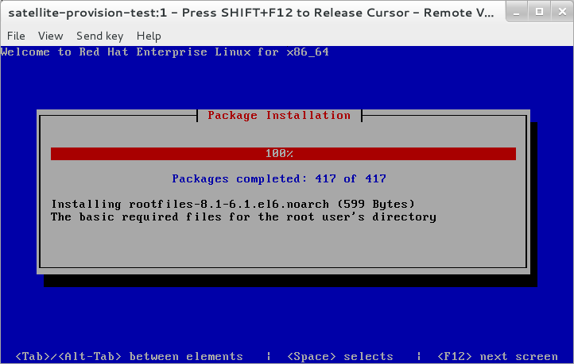
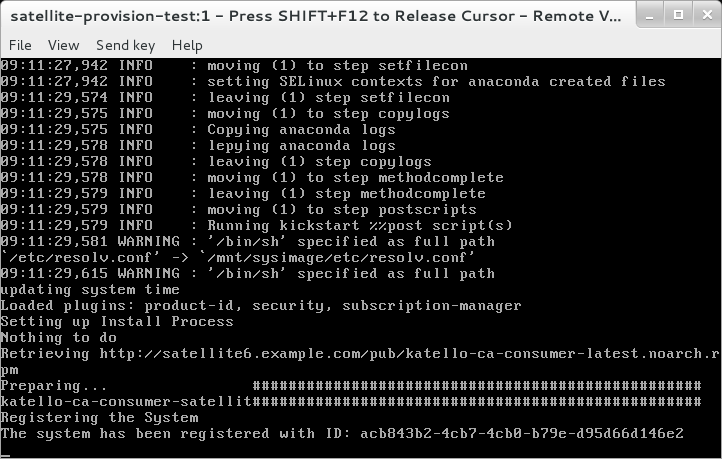
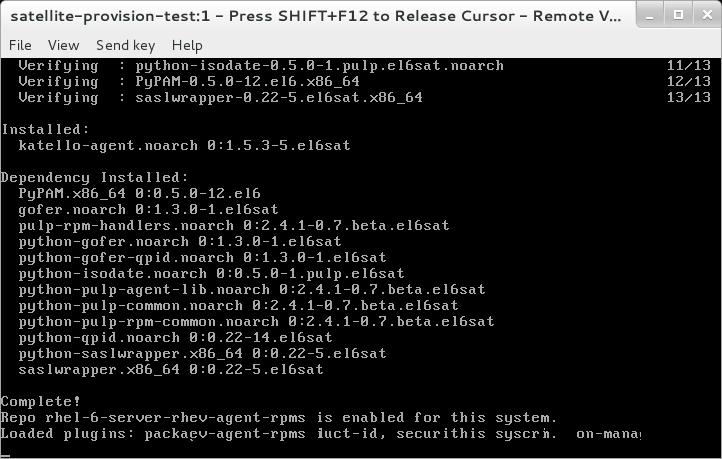
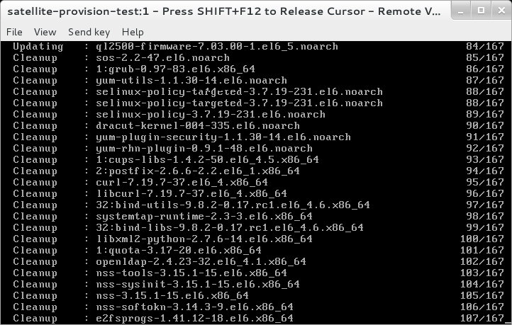
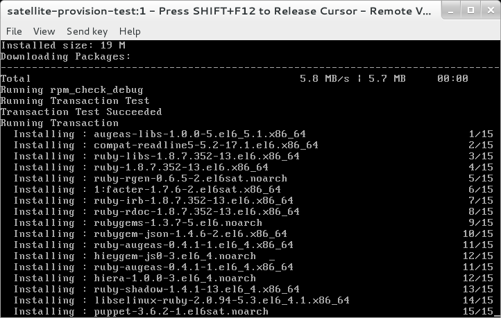
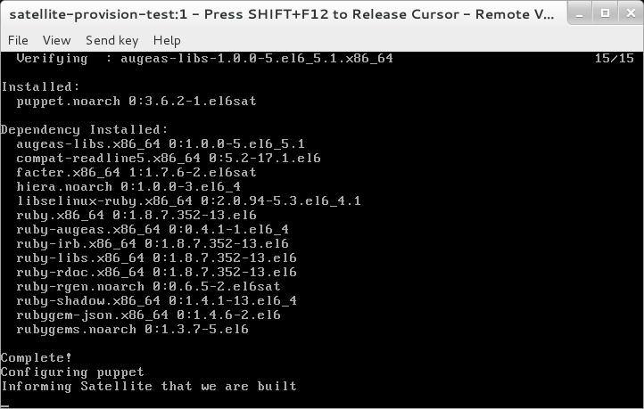
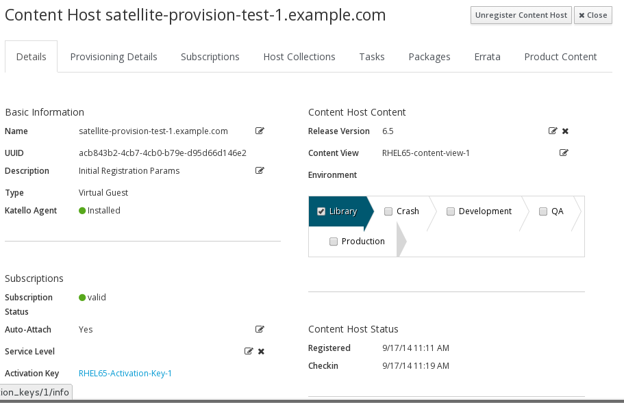

# Host Creation

Just as for the previous section, this page is now dramatically simpler, the workarounds have been removed, as in Satellite 6.1, they are no longer needed

As also mentioned in the previous section, setting of the root password at the **host-group** level is not possible, so we will set it here at the host creation stage


All we really need now, for bare metal provisioning (physical or virtual without compute resources configured) is a **mac-address**

```
hammer host create --hostgroup "DC North" --name="satellite-provision-test" \ 
 --mac "00:1a:4a:16:01:7a" --root-password "redhat00" \ 
 --organization "${ORG}" --location "${LOC}"
```


Now power on the host to be provisioned.

The build should progress in these distinct stages

The initial Anaconda package install stage



Next the post section will run, switching you to VT3 so that you can follow.

First it will register, via **subscription-manager**, to the Satellite



Next it will install the katello-agent



This will be followed by a ```yum update```



After the full update, the final install will happen, it will install **puppet**



Finally, once puppet installs, it will configure puppet and inform the Satellite server that it is built



Back on the Satellite Server, under ```Hosts > All Hosts```
, you will see the new host initally has a blue A (Active) next to it. This simply means that puppet has made changes during its initial run. It will change to a green O (no changes) next time puppet runs -in about 30 mins time.


Also on the Satellite Server, check the status of the **Content Hosts** ```Hosts > Content Hosts```  


Click on the **Content Host** to see more details (*the screenshots abave and below need updating*)




