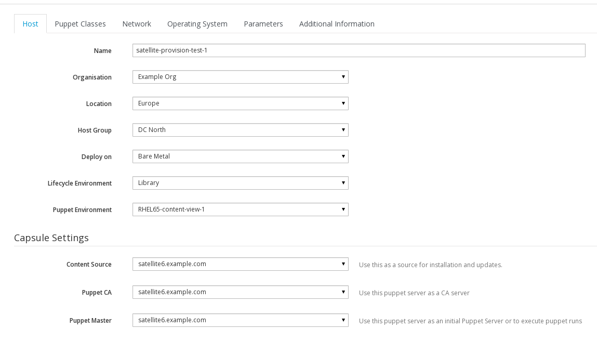
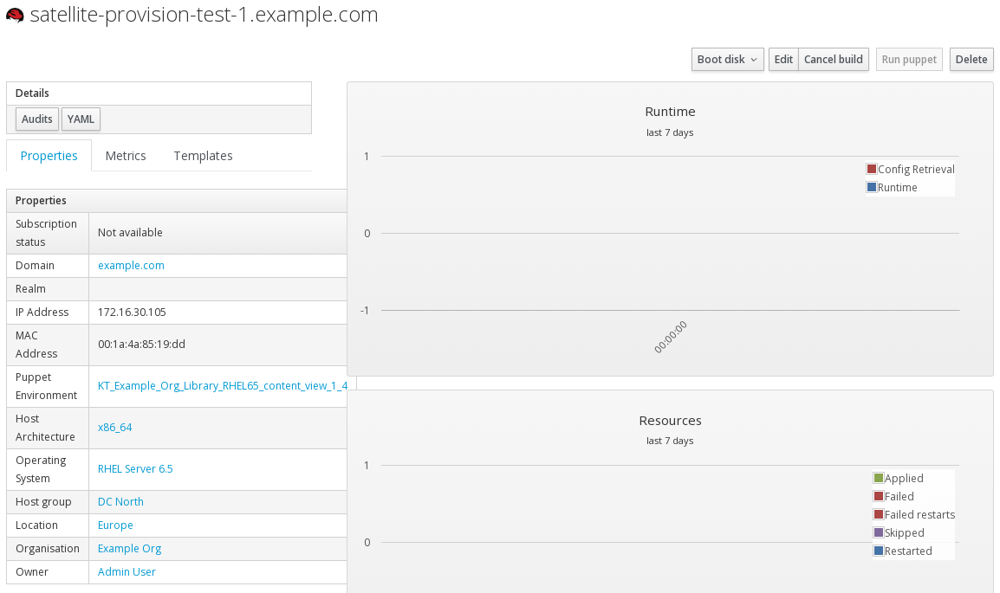

# Host Creation

>**Note:** Currently there is no way of creating a new host from hammer, which is dissapointing. I have opened this [bug](https://bugzilla.redhat.com/show_bug.cgi?id=1153034)

>As with **host group** creation, I will add a couple of work arounds (one uses the API and one uses the web UI) until the bug is fixed. Sorry

The below solution is taken directly from the  [sister book](http://gsw-satellite6.documentation.rocks/)


----
#### Work Around 1

This is another work around sent to me by Rodrique Heron. Its a little bigger than the previous one but here goes

##### Create Host

Creating a host from the CLI with hammer requires the following options:

 * --environment-id
 * --architecture-id
 * --domain-id
 * --puppet-proxy-id
 * --operatingsystem-id
 * --partition-table-id


These options can be satisfied via a hostgroup, which will be assumed already exist for this exercise.


##### Define the organization, location and capsule name and id for the host.

```
export ORG_NAME=MyOrg
export ORG_LOCATION=MyLocation
export ORG_ID=$(hammer --csv organization list --search "${ORG_NAME}"| awk -F, 'FNR == 2 {print $1}')
export LOCATION_ID=$(hammer --csv location list --search "${ORG_LOCATION}" | awk -F, 'FNR == 2 {print $1}')
```

##### Define the Hostgroup name and ID

```
export HOSTGROUP_NAME='rhel-6-x86_64-soe'
export HOSTGROUP_ID=$(hammer --csv hostgroup list --search "name = \"${HOSTGROUP_NAME}\""| awk -F, 'NR==2 {print $1}')
```

##### Create Host

```
export DOMAIN_NAME='example.com'
export HOST_SHORTNAME="test-103"
export HOST_FQDN="${HOST_SHORTNAME}.${DOMAIN_NAME}"
export HOST_MAC='52:55:00:54:0b:e1'
export ROOT_PWD='12345678FOOD'

hammer host create --ask-root-password false --build false --hostgroup-id ${HOSTGROUP_ID} --mac ${HOST_MAC} --name "${HOST_SHORTNAME}" --root-password ${ROOT_PWD}
```

##### Associate the host to an organization and location

The functionality is not available with the hammer cli, we will leverage the API instead.

```
export HOST_ID=$(hammer host list | grep "${HOST_SHORTNAME}" | awk '{print $1}')

json_file=$(mktemp)
cat > ${json_file} <<EOF
{"organization_id":"$ORG_ID","location_id":"$LOCATION_ID"}
EOF

curl -X PUT -k -u admin:securepassword -H 'Content-Type: application/json' -d @${json_file} https://localhost/api/hosts/${HOST_ID}
```

Full documentation of this above work-around is located [here](https://gist.github.com/swygue/854e4b6686ed2bbb2b49)

----
#### Work Around 2

From the web UI, go to

```Hosts > New Host```

Enter the hostname (without the domain name) of your new host. The **Organisation** and **Location** fields should be correct already. Select the **Host Group** from the dropdown, most other entries will now auto populate, with the exception of **Content Source**. Select the **Content Source**



Now over on the **Network** tab, check that the **Domain** is correct (leave **Realm** empty) and paste in the MAC address of the host you are provisioning. (check that IP is auto suggetsed - if not see troubleshooting section)

Verify that, on the Operating System Tab, that **Architecture**, **Operating system**, **Media** and **Partition table** are set and hit **Submit**

After a few seconds a screen like this should appear



Now power on the host to be provisioned.

The build should progress in these distint stages

The initial Amaconda package install stage


Next the post section will run, switching you to VT3 so that you can follow.

First it will register, via **subscription-manager**, to the Satellite


Next it will install the katello-agent


This will be followed by a ```yum update```


After the full update, the final install will happen, it will install **puppet**


Finally, once puppet installs, it will configure puppet and inform the Satellite server that it is built


Back on the Satellite Server, under ```Hosts > All Hosts```
, you will see the new host initally has a blue A (Active) next to it. This simply means that puppet has made changes during its initial run. It will change to a green O (no changes) next time puppet runs -in about 30 mins time.


Also on the Satellite Server, check the status of the **Content Hosts** ```Hosts > Content Hosts```


Click on the **Content Host** to see more details


