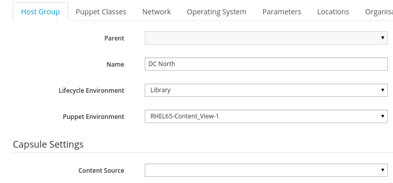

# Defining Host Groups

Host groups take lots of settings

```
hammer hostgroup create --help
Usage:
    hammer hostgroup create [OPTIONS]

Options:
    --architecture ARCHITECTURE_NAME Architecture name
    --architecture-id ARCHITECTURE_ID
    --domain DOMAIN_NAME          Domain name
    --domain-id DOMAIN_ID         May be numerical id or domain name
    --environment ENVIRONMENT_NAME Environment name
    --environment-id ENVIRONMENT_ID
    --medium MEDIUM_NAME          Medium name
    --medium-id MEDIUM_ID
    --name NAME
    --operatingsystem-id OPERATINGSYSTEM_ID
    --parent-id PARENT_ID
    --ptable PTABLE_NAME          Partition table name
    --ptable-id PTABLE_ID
    --puppet-ca-proxy-id PUPPET_CA_PROXY_ID
    --puppet-proxy-id PUPPET_PROXY_ID
    --puppetclass-ids PUPPETCLASS_IDS Comma separated list of values.
    --realm REALM_NAME            Name to search by
    --realm-id REALM_ID           May be numerical id or realm name
    --subnet SUBNET_NAME          Subnet name
    --subnet-id SUBNET_ID
    -h, --help                    print help
```

We will create a host group called **"DC North"** in the **Library** - **Lifecycle Environment**. From the previous section, we know that our **--operatingsystem-id** is **1** and the ** --ptable** is **7**

```
hammer hostgroup create --name "DC North" \
--architecture "x86_64" --domain "example.com"\
--environment "KT_Example_Org_Library_RHEL65_Content_View_1_5"\
--medium "Example_Org/Library/Red_Hat_6_Server_Kickstart_x86_64_6_5"\
--operatingsystem-id 1 --ptable "Kickstart default"\
--puppet-ca-proxy-id 1 --puppet-proxy-id 1 \
--subnet "172.16.30.0/24"
```

Right away, we need to add it to to our **location** and **organisation**

```
hammer location add-hostgroup --name "Europe" --hostgroup "DC North"

hammer organization add-hostgroup --name "Example Org" --hostgroup "DC North"
```
Lets see what we have

```
hammer hostgroup info --name "DC North"
Id:                     1
Name:                   DC North
Label:
Operating System:       RHEL Server 6.5
Environment:            KT_Example_Org_Library_RHEL65_Content_View_1_5
Model:
Ancestry:
Subnet:                 172.16.30.0/24
Domain:                 abcloud.pw
Architecture:           x86_64
Partition Table:        Kickstart default
Medium:                 Example_Org/Library/Red_Hat_6_Server_Kickstart_x86_64_6_5
Puppet CA Proxy Id:     1
Puppet Master Proxy Id: 1
ComputeProfile:
Puppetclasses:

Parameters:

Locations:
    Europe
Organizations:
    Example Org
```


Things missing at this point (not necessarilyvisible from the hammer output above, but from the UI)

* Content Source
* Password
* Activation Key

The activation key we can use **set-parameter** to set

```
hammer hostgroup set-parameter --hostgroup "DC North" \
--name "kt_activation_keys"  --value "RHEL65-Activation-Key-1"
```

That only really leaves "Content Source", but hammer doesnt seem to have a way to set this. Setting it from the UI shows three more params

```
    kt_cv => RHEL65-Content_View-1
    kt_env => Library
    kt_org => Example_Org
```

But setting those manually...

```
hammer hostgroup set-parameter --hostgroup "DC North"\
--name "kt_env" --value "Library"

hammer hostgroup set-parameter --hostgroup "DC North"\
--name "kt_cv"  --value "RHEL65-Content_View-1"

hammer hostgroup set-parameter --hostgroup "DC North"\
--name "kt_org"  --value "Example_Org"
```

...still doesnt set the UI element :-/ It turns out that this functionality isnt yet in Hammer. This bug tracks the issue [Bug #7597: Hammer cant set "Content Source"](http://projects.theforeman.org/issues/7597)

>**Note:** I was holding back on publishing the book until this was resolved but now I have decided to go ahead and show the work around, I shall update the book once this is fixed


#### Workaround

To change this, go to the web UI and select **Host Groups** under **configure**. Click on the **Host Group** you want to edit, and select the entry in the drop down for **Content Source** which you can see is blank in the screen shot below



We now have our **Host Group** configured and are ready to create our first host to be provisioned.


