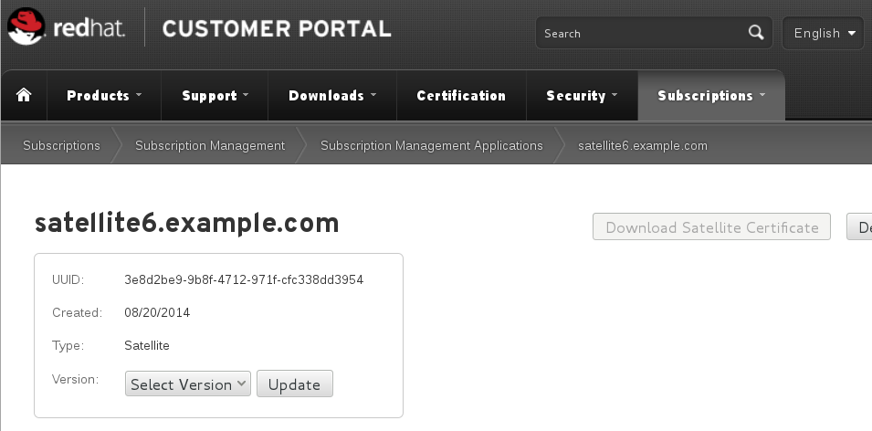

# Registration

I like to follow a very precise way of registering the box, one that I have worked out over many installation methods. While its not the way currently mentioned in the [official documentation](https://access.redhat.com/documentation/en-US/Red_Hat_Satellite/), it works for me 100% of the time.

From a command prompt type the following

`subscription-manager register --type=satellite`

You will then be prompted for your credentials, enter them and the system should be correctly registered, but not attached/consuming entitlements

At this point its important to logon to the Red Hat Customer Portal and set the version of Satellite to 6.0

